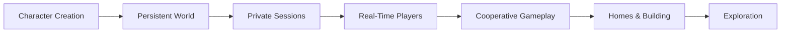
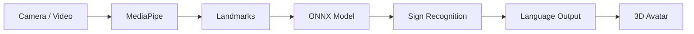
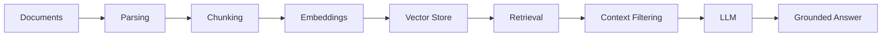
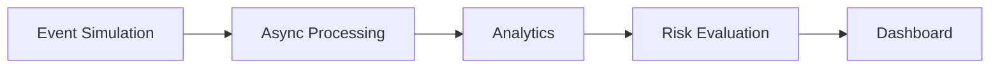
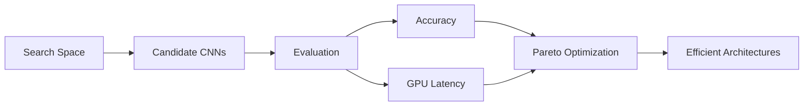

<div align="center">


<br>


<br><br>

<a href="https://nadjiba-portfolio.vercel.app/">

</a>
<a href="https://www.linkedin.com/in/rahal-nadjiba-264053339">

</a>
<a href="mailto:rahalnadjiba5@gmail.com">

</a>

<br><br>


<br><br>

**Final-Year State Engineering Degree in Computer Science**
**École Nationale Supérieure d'Informatique — ESI Algiers**
*Intelligent Systems & Data Science*

</div>

---

# `01` — About

My projects range from **agentic AI and multimodal systems** to **machine learning research, real-time applications, backend platforms and 3D systems**.

I care about the layer between a model and a real product:

**data → models → intelligence → systems → deployment**

<br clear="right"/>

### Currently interested in

`AI Engineering` · `Agentic Systems` · `Computer Vision` · `Multimodal AI` · `Data Engineering` · `Backend Systems` · `Efficient ML`

---

# `02` — What I Build

<div align="center">

| <br>**AI Systems** | <br>**Machine Learning** | <br>**Data Systems** | <br>**Software** |
| ------------------------------------------------------------------------------------------------------ | ------------------------------------------------------------------------------------------ | ----------------------------------------------------------------------------------------- | --------------------------------------------------------------------------------- |
| Agents                                                                                                 | Computer Vision                                                                            | Pipelines                                                                                 | Backend                                                                           |
| RAG                                                                                                    | NLP                                                                                        | Retrieval                                                                                 | Full-Stack                                                                        |
| LLM Apps                                                                                               | Multimodal AI                                                                              | Analytics                                                                                 | Mobile                                                                            |
| Automation                                                                                             | Model Evaluation                                                                           | Real-Time                                                                                 | 3D / Web                                                                          |

</div>

---

# `03` — Selected Projects

## ◈ AFTERLIGHT

<div align="center">

### **A persistent 3D multiplayer world**

</div>

An experimental online world built around **cooperative exploration, customization and shared experiences**.



**Current systems**

|             |                                                     |
| ----------- | --------------------------------------------------- |
| 3D World    | Three.js + React Three Fiber                        |
| Physics     | Rapier                                              |
| Characters  | Data-driven customization                           |
| Multiplayer | WebSockets                                          |
| Sessions    | Private 2–8 player rooms                            |
| State       | Shared realtime player state                        |
| Roadmap     | Building · Crafting · Quests · Exploration · Mobile |

**Stack**

`TypeScript` `React` `Three.js` `R3F` `Drei` `Rapier` `WebSockets`

<a href="https://github.com/Nadjiba-Rahal/open-world">

</a>

---

## ◈ PORTFOLIO

<div align="center">

### **Interactive AI & Software Engineering Portfolio**

<a href="https://nadjiba-portfolio.vercel.app/">

</a>

</div>

A custom web platform designed to present my **engineering projects, research, experience and technical work** through an interactive interface rather than a conventional resume.

**Stack**

`Next.js` `React` `TypeScript` `Tailwind CSS` `Vercel`

---

## ◈ BELLEVUE

<div align="center">

### **Medical Practice Management Platform**

</div>

A full-stack platform for a medical practice combining a public booking experience with administrative management.

**Features**

`Appointment Booking` · `Availability` · `Admin Dashboard` · `Authentication` · `Schedule Management`

**Stack**

`Next.js` `React` `TypeScript` `PostgreSQL` `Server Actions`

---

## ◈ ISHARA

<div align="center">

### **Algerian Sign Language AI Platform**

</div>

An end-to-end accessibility system combining **computer vision, machine learning and 3D avatar technology** for Algerian Sign Language.



**Highlights**

* **417-word** Algerian Sign Language dictionary
* Video-based recognition
* MediaPipe landmark extraction
* PyTorch model development
* ONNX inference
* 3D avatar rendering
* Web + mobile architecture

**Stack**

`Python` `PyTorch` `ONNX` `MediaPipe` `.NET` `ASP.NET Core` `Next.js` `React Native` `Three.js`

---

## ◈ AGENTIC VIDEO ASSISTANT

<div align="center">

### **Multi-Agent Generative Video Pipeline**

</div>

A modular AI system that transforms an idea into a structured, generated and composed video.

```text
Idea
 ↓
Research
 ↓
Script / Prompt
 ↓
Director Agent
 ↓
Storyboard
 ↓
Scene Generation
 ↓
FFmpeg Composition
 ↓
Final Video
```

**Focus**

`Agent Orchestration` · `Tool Calling` · `Prompt Engineering` · `Async Workflows` · `Video Generation`

**Stack**

`Python` `smolagents` `Gradio` `FFmpeg` `Docker`

---

## ◈ DOCUMENT RAG ENGINE

<div align="center">

### **Multilingual Document Intelligence**

</div>

A multilingual retrieval-augmented generation system designed for **English, French and Arabic** documents.



**Focus**

`Multilingual Retrieval` · `Embeddings` · `Vector Search` · `Grounded Generation` · `Evaluation`

**Stack**

`Python` `FastAPI` `LangChain` `ChromaDB` `Sentence Transformers` `Llama 3` `Groq`

---

## ◈ ENTERPRISE E-COMMERCE

<div align="center">

### **AI-Enhanced Commerce Platform**

</div>

A full-stack commerce platform designed around the operational requirements of **cash-on-delivery businesses**.

**Features**

`Product Management` · `Authentication` · `AI Product Content` · `Inventory` · `Cloudinary` · `Local Delivery`

**Stack**

`Next.js` `TypeScript` `MongoDB Atlas` `Cloudinary` `Vercel`

---

## ◈ COMMERCE INTELLIGENCE

<div align="center">

### **Real-Time Commerce Telemetry & Risk Engine**

</div>

A streaming-style data system for simulating commerce activity, processing events asynchronously and producing operational risk signals.



**Stack**

`Python` `asyncio` `DuckDB` `Streamlit`

---

## ◈ SENTIMENT ANALYSIS

### **BERT-Based NLP Pipeline**

An end-to-end Transformer pipeline covering text preprocessing, tokenization, contextual representation and sentiment classification.

**Stack**

`Python` `PyTorch` `Transformers` `BERT` `NLP`

---

# `04` — Research

<div align="center">

### Research is where I explore what happens when intelligent systems meet real-world constraints.

</div>

---

## Medical Vision-Language Models

### **What Does Language Alter Medical Vision-Language Model Decisions Across Domains?**

Research studying the interaction between **language shift and medical domain shift** in vision-language models.

The work evaluates multilingual medical VLM behavior on chest X-ray data and investigates how model decisions change across languages and acquisition domains.

**Topics**

`Medical AI` · `Vision-Language Models` · `Multilingual Evaluation` · `Domain Shift` · `Robustness`

---

## HAMOS-NAS

### **Multi-Objective Hardware-Aware Neural Architecture Search**

Research on automatically discovering CNN architectures while jointly considering predictive performance and hardware constraints.



**Highlights**

`~15,000 Architectures` · `Multi-Objective Optimization` · `GPU Benchmarking` · `Pareto Analysis`

**Topics**

`Neural Architecture Search` · `Efficient AI` · `Model Optimization` · `Hardware-Aware ML`

---

# `05` — Technology

<div align="center">

### Languages


### AI / Machine Learning


<br>


### Backend / Data


### Frontend / Mobile / 3D


### Infrastructure


</div>

---

# `06` — Engineering Principles

<div align="center">

|    **Build systems, not demos**   |          **Measure what matters**         |       **Keep intelligence modular**      |
| :-------------------------------: | :---------------------------------------: | :--------------------------------------: |
| Connect models to usable software | Evaluate quality, latency and constraints | Separate data, AI and application layers |

</div>

I enjoy the part where separate pieces become one system:

```text
Data
  ↓
Models
  ↓
Intelligence
  ↓
APIs
  ↓
Applications
  ↓
Real Users
```

---

# `07` — Experience

<div align="center">

| Role                           | Organization | Area                               |
| ------------------------------ | ------------ | ---------------------------------- |
| **Data Science Intern**        | Sonatrach    | Data · Analytics · Power BI        |
| **Information Systems Intern** | Sonelgaz     | Enterprise Systems                 |
| **Engineering Student**        | ESI Algiers  | Intelligent Systems & Data Science |

</div>

---

# `08` — Certifications

<div align="center">


</div>

---

<div align="center">

# Let's build something intelligent.

<a href="https://nadjiba-portfolio.vercel.app/">

</a>

<a href="https://www.linkedin.com/in/rahal-nadjiba-264053339">

</a>

<br><br>

<br>

<i>AI × Software × Data</i>

</div>
