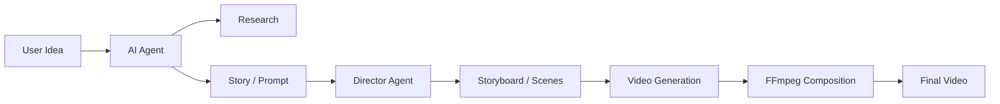
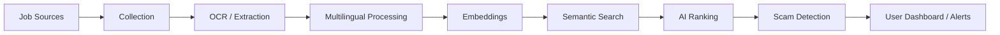
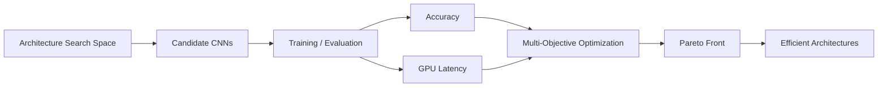
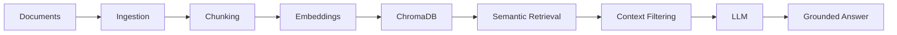
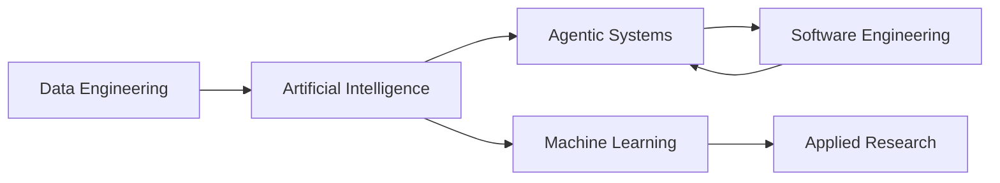

  <strong>AI Software Engineering · Machine Learning · Agentic AI · Data Systems</strong>

  Final-Year State Engineering Degree in Computer Science 
  <strong>École Nationale Supérieure d'Informatique — ESI Algiers</strong> 
  Intelligent Systems & Data Science

  
  
  

---

##  About

I build **AI-powered software systems that connect machine learning with production engineering**.

My work spans:

* **Agentic AI & LLM applications**
* **RAG and semantic search**
* **Machine learning & computer vision**
* **Data engineering & real-time systems**
* **Backend/API architecture**
* **Neural Architecture Search**
* **Multimodal and medical AI research**

Currently focused on building systems that move beyond individual models toward **complete, modular AI pipelines**.

### Target Roles

`AI Software Engineer` · `Machine Learning Engineer` · `AI Engineer` · `Data Engineer` · `Backend Engineer` · `AI Research Engineer`

---

#  Current Focus

<table>
<tr>
<th width="50%">Engineering</th>
<th width="50%">Research</th>
</tr>

<tr>
<td>

* Agentic AI systems
* Multi-agent orchestration
* RAG pipelines
* Real-time event-driven systems
* Backend APIs
* Data-intensive applications
* AI-powered automation

</td>

<td>

* Hardware-Aware Neural Architecture Search
* Multi-objective CNN optimization
* Medical Vision-Language Models
* Domain & language shift robustness
* Multimodal representation learning
* Efficient AI inference

</td>
</tr>
</table>

---

#  Featured Projects

## 01 · Agentic Video Assistant

**Multi-agent generative AI system for automated video creation**

A modular AI system that transforms a short idea into a generated video.

### What it demonstrates

* `smolagents`
* Agent orchestration
* Tool calling
* Prompt engineering
* Storyboard generation
* Scene-based video generation
* Asynchronous generation workflows
* FFmpeg composition

The architecture is designed to evolve toward a complete pipeline combining:

`Research → Script → Visuals → Voice → Music → SFX → Composition`

---

## 02 · Local AI Job Intelligence Agent

**AI-powered job discovery and intelligence system for the Algerian job market**

An automated system designed to collect, understand, classify and surface job opportunities from fragmented sources.

### Key capabilities

* Web and social-source collection
* OCR with EasyOCR / Tesseract
* Multilingual job extraction
* Semantic search
* Embeddings
* PostgreSQL
* Fuzzy Algerian location matching
* AI summaries
* Scam detection
* Telegram notifications
* FastAPI backend

**Focus:** AI agents + information retrieval + data engineering + automation.

---

## 03 · Sign Language AI Platform

**AI-powered accessibility platform for sign-language understanding**

A computer-vision project focused on recognizing sign-language gestures and connecting visual input with meaningful language output.

Current work includes:

* Video-based sign recognition
* Multi-signer / multi-camera dataset organization
* Automated label extraction
* Computer-vision preprocessing
* AI model training pipeline
* Accessibility-oriented application design

The project is being developed toward an end-to-end sign-language AI system rather than a standalone classification model.

---

## 04 · HAMOS-NAS

**Multi-Objective Hardware-Aware Neural Architecture Search**

Research-oriented project focused on automatically discovering efficient CNN architectures while considering both predictive performance and hardware constraints.

### Highlights

* ~15,000 candidate CNN architectures
* Multi-objective optimization
* Hardware-aware search
* Accuracy vs. latency analysis
* Pareto-front evaluation
* GPU benchmarking
* Dataset-based architecture evaluation

**Research area:** Neural Architecture Search · Efficient AI · Model Optimization

---

## 05 · Enterprise RAG Intelligence System

**Multilingual document intelligence platform**

A production-oriented RAG pipeline for querying complex documents across English, French and Arabic.

### Stack

`Python` · `FastAPI` · `ChromaDB` · `Llama 3` · `Groq` · `Streamlit` · `Docker`

### Focus

* Multilingual retrieval
* Vector search
* Context filtering
* Grounded generation
* REST APIs
* Automated evaluation

---

## 06 · Medical Vision-Language Model Research

**On the Interaction of Domain and Language Shifts in Medical Vision-Language Models**

Research investigating how changes in **medical domain and language** affect vision-language model performance and robustness.

The work explores models and approaches including:

* CLIP
* SigLIP
* BLIP / BLIP-2
* Flamingo
* LLaVA / LLaVA-Med
* ALIGN

### Research themes

`Domain Shift` · `Language Shift` · `Multimodal Learning` · `Medical AI` · `Robustness`

---

## 07 · AI-Enhanced E-Commerce Platform

**Live full-stack white-label e-commerce platform**

A production-style e-commerce application designed for the Algerian market.

**Live:**
https://blush-store.vercel.app

### Features

* Next.js 14
* TypeScript
* MongoDB
* NextAuth JWT authentication
* Cloudinary media management
* AI-assisted product copywriting
* Gemini / OpenRouter integration
* Cash-on-delivery checkout
* Local delivery workflows
* 58 Wilayas / commune-level delivery support
* Atomic inventory management

---

#  Technical Stack

### Languages

### AI / ML

### LLM / Agentic AI

### Backend & Data

### Engineering & Infrastructure

---

#  Engineering Principles

| Principle             | Approach                                                       |
| --------------------- | -------------------------------------------------------------- |
| **Modularity**        | Separate AI logic, services, data and interfaces               |
| **Maintainability**   | Clean architecture, reusable components and automated tests    |
| **Data Quality**      | Validation, bounded processing and structured data pipelines   |
| **Evaluation**        | Benchmark latency, retrieval quality and model performance     |
| **Practical AI**      | Focus on systems that can be integrated into real applications |
| **Efficient Systems** | Consider latency, memory and hardware constraints              |

---

#  Experience

| Role                           | Organization                   | Focus                                               |
| ------------------------------ | ------------------------------ | --------------------------------------------------- |
| **Data Analyst Intern**        | Sonatrach Exploration Division | SQL, Snowflake, data warehousing, Power BI          |
| **Information Systems Intern** | Sonelgaz                       | Enterprise document management, Oracle environments |
| **Technical Event Organizer**  | Women Techmakers               | Technical workshops and community initiatives       |

---

#  Certifications

* **Microsoft Applied Skills — Deploy Cloud-Native Apps Using Azure Container Apps** — 2026
* **Hugging Face — Fundamentals of Agents** — 2026
* **EF SET English Certificate — C1 Advanced** — 2026
* **AI Ethics — DataCamp** — 2026
* **Python for Everybody — University of Michigan / Coursera** — 2025

---

#  Current Direction

I am particularly interested in building systems at the intersection of:

My goal is to build **reliable AI systems that connect research, intelligent models and production software**.

---

# Contact

  <i>Building intelligent systems that bridge research and production.</i>

